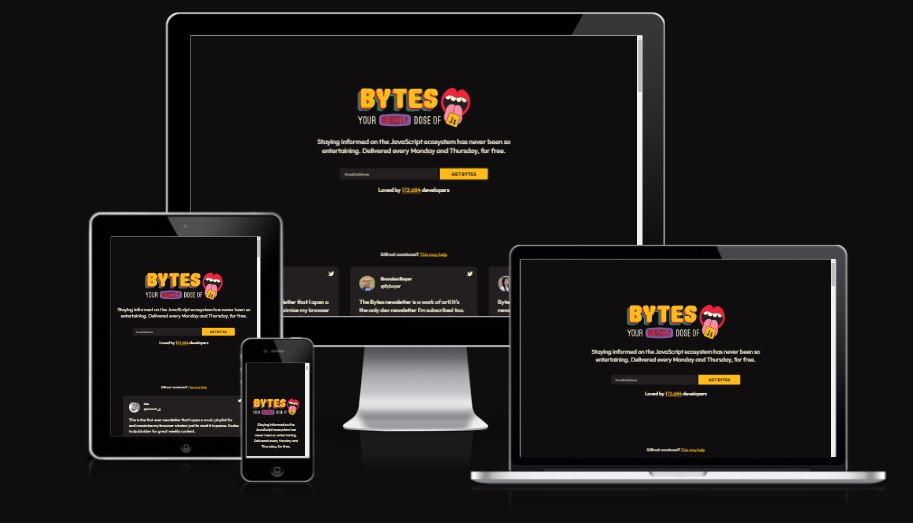
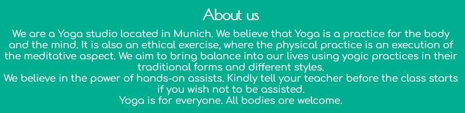
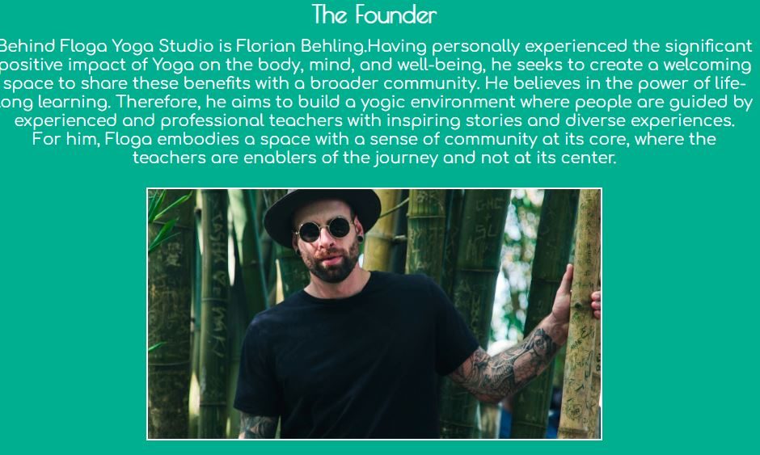
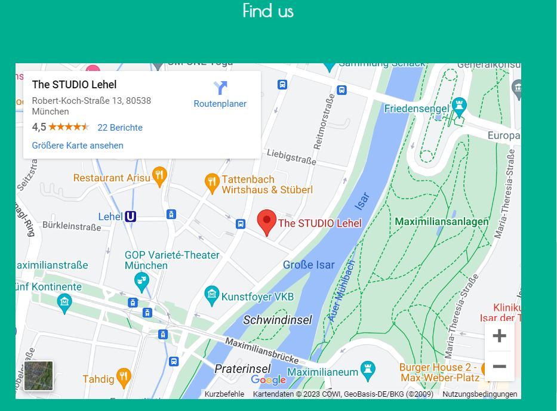
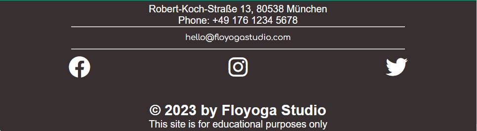
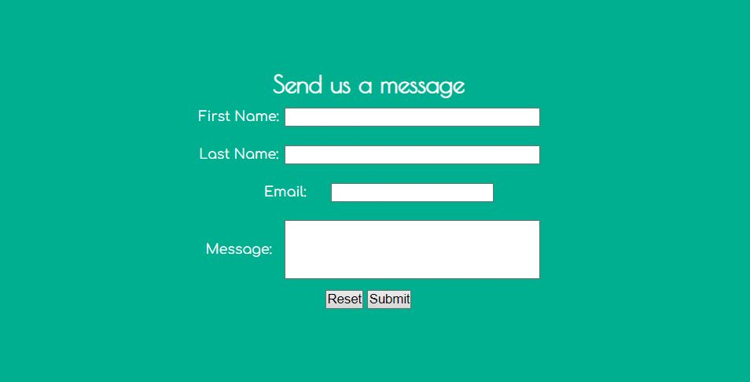

# Floga

Floga is a site for a Yoga studio that hopes to encourage people to embrace the therapeutic powers of Yoga practices on the body. The studio which is located in Munich, Germany, thrives to bring people together to practice different Yoga styles and exercises for the well being of the mind and body.
Floga site is targeted towards everyone who is interested in learning and practicing Yoga within a community of suportive people and instructors. It will be useful for all and everyone wishing to start a Yoga journey.

## Features

- Homepage: Introduces users to Floga, describes its location, the founder and our mission.

- Classes page: Displays the various classes that we offer at Floga in pictures in order to enable users have a pictorial view of what there stay at Floga will look like.

- Contact us page: it features our social media icons and a contact us form through which users can easily reach out to us.

## Existing Features

- **Navigation Bar**

- On the far right of all the pages, we have the responsive hamburger navigation bar. A click on this bar reveals links to navigate around the website like the Home, Classes, Contact and Thank you pages. The look and position of the navigation bar is consistent on all pages for easy exploration of the pages.
- This section will allow the user to explore the website with from page to page without having to use the 'back' button. This section also contains the logo of the website which is on the top far left corner of the page.

- **The Hero/Landing Page Image**

- The hero image consists of a lady doing Yoga by the sea side. Over this photograph there's a text overlay.
- This section also includes a "Discover" button, upon clicking this button, it navigates the user to the Classes page, which reveals the various yoga classes available to be booked on the Floga website.

- **The About Us Section**

- This section contains a short introductory message about Floga. It describes Floga's motivations and the location of the studio.
- This section also tells the user the benefits of practicing yoga and why they should sign up with Floga.
- It also contains instructions on preferences and teacher relationship.

- **The Founder Section**

- The Founder section introduces the user to the founder of Floga. It explains his qualities and why he is best qualified to teach yoga to the users. This builds credibility and trust in the user ensuring that they are in capable hands.
- The founder's motivation to start Floga is also included in this section.
- The section contain's the founder's name and photograph.

- **The Find Us Section**

- In this section, we have included a map where the location of the Floga studio is pin pointed.
- The map includes all the areas surrounding the studio and also + and - buttons which helps the user zoom in and out of the map.
- This helps the user to see the environs of the Floga studio, which makes it easier to locate the studio without any problems.

- The footer section includes the street address, phone number and email address of Floga.
- It also contains the links to the social media sites for Floga. Upon clicking the links, they open on another page for easy navigation.
- The footer is useful to the user because it will help them keep in touch with Floga through various means.

- **The Classes Page**

- This page exposes the user to the different yoga classes that are available for practice at Floga.
- The page also explains each yoga class and their benefits.
- There is also a "Team" section on the classes page which contains Floga founder, where he was born and where he trained as a Yogi.

- **The Contact Page**

- This page consists of a form which requests for details of the users and any message they wish to send to Floga.

- This page serves as a medium through which the user could ask any questions or reach out to the studio.
- It requires the full name of the user for easy identification.

- **The Thank You Page**

-This page contains a short thank you note to the user.

- The page appreciates the user for contacting the studio and assures that they would get a response very soon.
- This makes the user feel valued and appreeciated for the time and efforts spent on contacting Floga.

## Validator Testing

- HTML: while testing my index.html file through the official <a href="https://validator.w3.org/">W3C validator</a>. it discovered an error on line 52 of my code which was a result of a closing button tag without an opening tag. However I have fixed the error and the validator confirmed that I have no errors or warning to show.
  My other html files were also tested and it passed according to the validator.

- CSS: I tested my style.css file and No errors were found when passing through the official <a href="https://jigsaw.w3.org/css-validator/">(Jigsaw) validator</a>

## Unfixed Bugs

There are no unfixed bugs known to me.

## Deployment

The site was deployed to GitHub pages. The steps to deploy are as follows:

- After pushing your code to github, In the GitHub repository, navigate to the Settings tab.

- From the source section drop-down menu, select the Main Branch.

- Once the main branch has been selected, click on save and wait for a minute.

- The page will be automatically refreshed with a detailed ribbon display to indicate the successful deployment.

The live link can be found here: https://Sandin-M.github.io/Floga-Yoga-Studio

## Credits

- media-images: <a href="https://pixabay.com/">Pixabay</a>  
  <a href="https://www.shutterstock.com/">Shutterstock</a>

- extra help: My mentor (Funbi Yusuf)
